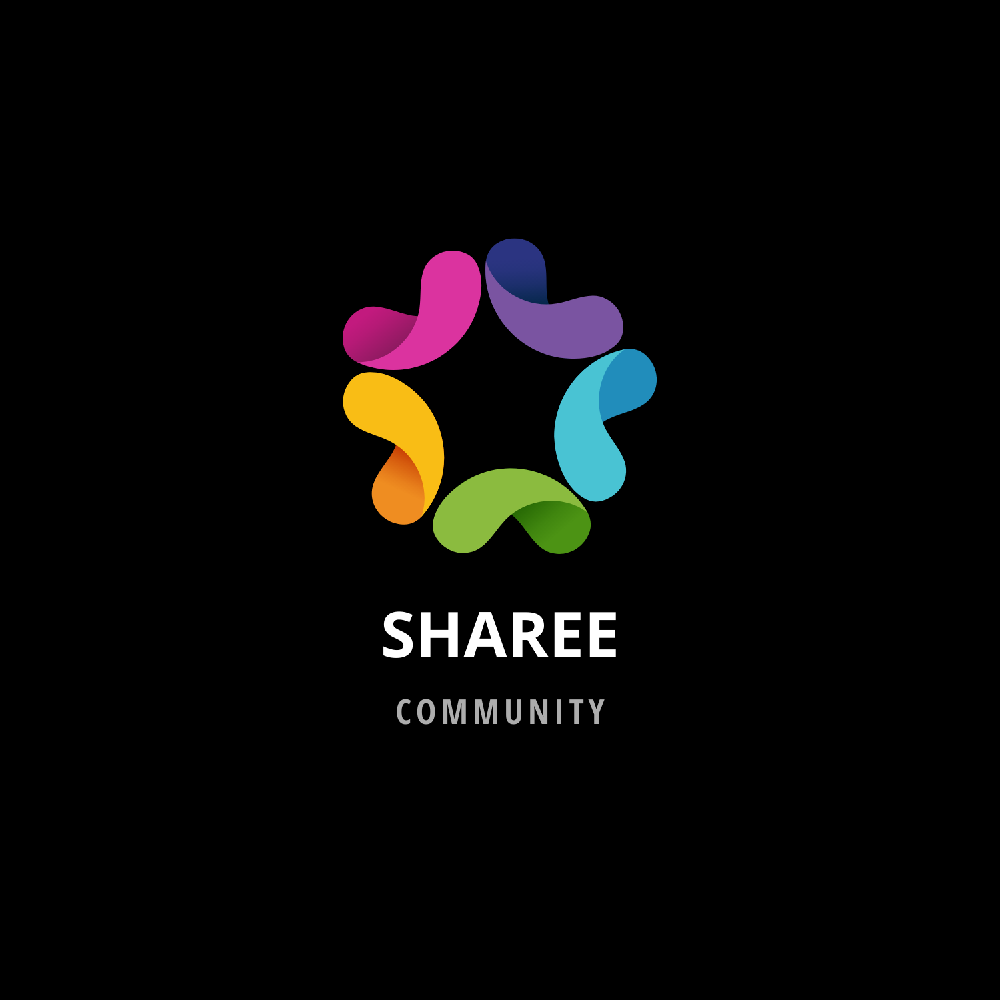

# Sharee2022
(Plantilla para la creación de un proyecto en ideapolis)

# 
 Proyecto de Inteligencia Colectiva y Formación en la Empresa Master en Gestión y Tecnologías de Procesos de Negocio ETS Ingeniería Informatica y de Telecomunicación Univesidad de Granada. 

# Titulo : Sharee

# Autor(es): Daniela Morales, Adriana Carrillo, Jenny Ruiz, Andres Gamarra.

 Resumen : Sharee nace a partir de esta necesidad detectada pues es una comunidad creada con el fin de fomentar un espacio para compartir experiencias entre estudiantes internacionales (huéspedes) y estudiantes nacionales (anfitriones) residentes en Granada.

# Logotipo : 

Slogan: Comparte experiencias, y en el camino construye grandes amistades.

Hashtag: #ComunidadAmigos #Amigos #Sharee #Estudiantes #CompartirExperiencias

Licencia: 

Fecha: Abril 2022

# Redes Sociales:  

*  Guithub:https://github.com/Andgam1/Sharee2022#readme  
*  Instagram:Poner enlace  
*  Tweeter:Poner enlace  

# ¿Quiénes somos?  

 Somos un grupo de 4 estudiantes del Máster en Gestión y Tecnologías de Procesos de Negocio, tras un Brainstorming realizado en clase, llegamos a la conclusión de que era necesario formar esta comunidad. Tenemos la suerte de compartir clase con personas de diversas nacionalidades y religiones, por ello sabemos de la riqueza que proporciona la conexión mental y física con otros países. Es así como nació esta idea que titulamos como "Sharee".

# Misión  

# Visión  

# Acerca de Nosotros

# Metodología
Metodología de desarrollo: Diseño de contenidos digitales mediante estrategia de diseño de Experiencias de usuario (UX experiences)

* # Etapa 1: Ideación de proyecto

El proyecto surgió a raiz de brainstorming realizado en clase, donde nos dimos cuenta que era necesario crear una comunidad para que los estudiantes extranjeros se pudieran adaptar mucho mas facil a la cultura y experiencia en Granada. Actividades realizadas mediante Trello https://trello.com/b/VBfGb6pJ/sharee. 

Investigación de campo Desk research propuestas inspiradoras para el proyecto)

@LadyDistopia (link) ...¿ por qué ?
(...)
Necesidad/oportunidad

Motivación de la propuesta .... ¿ por qué consideras interesante ?

Personas/Usuarios (...¿en quién piensas que puede ser útil ? ¿cual es tu publico objetivo?)

* # Etapa 2: Prototipar / productos
(Productos que has desarrollado y como se plantea la integración de los diferentes medios, pon los que uses)

Imagen visual (Portada / Diseño de Interfaz) y herramienta usada

publicidad: banner (... )

...

* # Etapa 3: Técnicas de evaluación utilizadas
(Estrategia que plantearías para evaluar tu propuesta, medidodes e indicadores de éxito, elige / propone)

Test con usuarios (...)
...
Conclusiones y trabajo futuro
Grado de consecución del proyecto
Problemas identificados (técnicos / sobre la idea inicial / planificacion… )
Propuestas de mejora (por qué consideras que merece la pena continuar)
Posible interés del proyecto (¿ Quien podría colaborar / involucrarse en el proyecto? ¿viable?)
Referencias y recursos:

Artículos ..
Productos utilizados
Propuestas de mejora
(...)

Referencias y recursos utilizados :

Proceso UX
Diseño de Experiencias UX
Métodos UX
MuseMap: ejemplo de experiencia UX
(...)
(...)

(Artículos .. )
(Productos utilizados )
(Recursos tipo Imágenes, videos , etc.)
